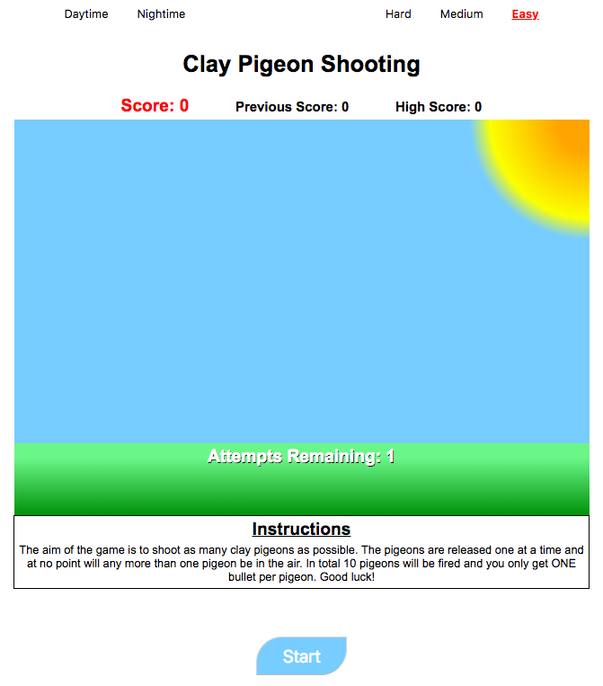
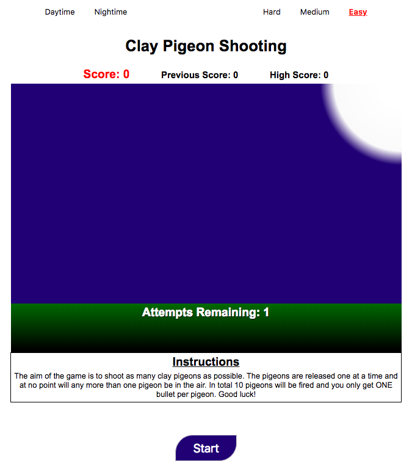
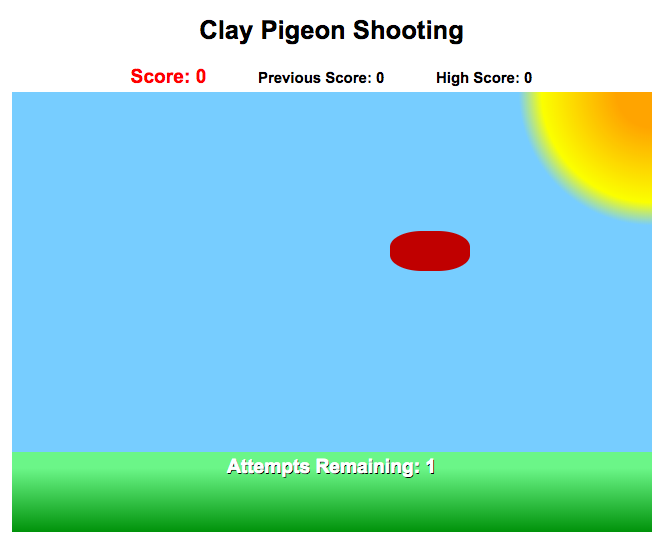
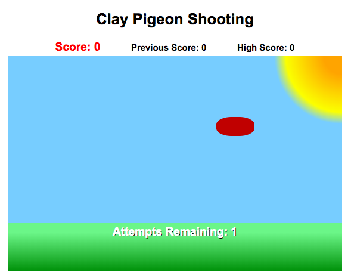
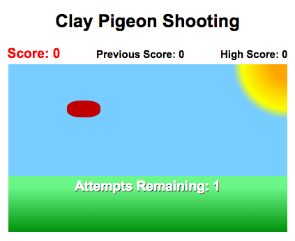

# Clay Pigeon Shooting
This Clay Pigeon Shooting game is a very similar concept to 'Duck Hunt'; the well known light gun shooter video game developed in 1984 by the people at Nintendo for the historic Nintendo Entertainment System (NES). The nostalgia of games like Duck Hunt, and other similar one-person-shooters, has inspired the creation of this Clay Pigeon Shooter.

## Tools

The entire game was constructed with only a few of the basic langauges:

* **HTML**: Provides the (non-styled) content that is displayed to the screen.
* **CSS**: Styles the content which HTML provides.
* **JavaScript**: Allows the HTML content to be interactive. A simple example of how this is useful is when we want to update the user's score whilst the game is in progress.
* **jQuery**: This also allows the HTML content to be interactive, but relative to JavaScript, has a more concentrated and 'simple' syntax. 

## How To Play

* The player must attempt to hit 10 clay pigeons.
* The player only gets **one** shot per pigeon (so make sure your aim is on point!). If the player misses the pigeon then he/she will no longer be able to hit the pigeon until the next is released.
* The clay pigeons are released one at a time, and randomly with respect to the right and left hand side of the 'board'. Only when the pigeon has either been successfully shot **or** the pigeon manages to escape from the shooting range (i.e. collide with the edge of the container) will the next pigeon be released.
* Successfully hitting the pigeon will gain the player 30 points
* If the player misses the pigeon, he/she will be deducted 10 points (scores will go negative if you have a terrible aim!)
* The simple aim of the game is to hit as many pigeons as possible!
* **TO NOTE**: In order to successfully click the pigeon, more-so in the hard difficulty mode, the user must aim and click either very slightly above the clay pigeon or at the very top of the image. This is a slight development problem discussed later on.

## How to play

By clicking on the following link, you will be relocated to the website where the game is hosted...

[Click here to play the game](https://rhystheaker.github.io/Clay-Pigeon-Shooting/)

In order to obtain a copy of the full working code then proceed with the following steps:

1. Go to my [GitHub Profile](https://github.com/RhysTheaker/Clay-Pigeon-Shooting) which corresponds to the game.
2. Click the  image and copy the address that is provided.
3. In your console, re-locate to where you wish the cloned-repository to be stored.
4. In your command line type "git clone URL", where URL is the address that you have just copied from GitHub, and finally press enter. 

## Summary

This Clay Pigeon Shooting game has two backgrounds that you can toggle between; day-time and night-time, as demonstrated below.

### Daytime Background

### Nightime Background

In addition, the user may also toggle between three difficulties: 'Easy', 'Medium' and 'Hard'. As the difficulty increases, the size of the container, in which the player may shoot the pigeon, will consequently decrease. Furthermore, the size of the pigeon will decrease. It should be noted however that the speed of the pigeon will remian constant, and this decision will be elaborated on later in the 'Issues' section. Below, I have selected a few images to demonstrate the relative nature of the 3 difficulty modes.

### Easy

### Medium

### Hard

## Recommendations
The game only requires a (working) mouse! It goes without saying that you will probably need a hand that functions so you can click... 

## Development Process
I tried to work in the most methodical way possible, i.e. starting with the most basic principles first to obtain a Minimum Viable Product (MVP) and then develop the game further once this was achieved.

As mentioned in the opening paragraph, the decision to make a Clay Pigeon Shooting game was due to the old-school Nintendo game, 'Duck Hunt'. With this in mind I was adamant that the styling of the game would try to replicate the era from which the inspiration stemmed from.

The full game development process was as follows:

* Firstly, the 'board' where the game would be played was created. This was done purely using basic HTML and CSS.
* The next task was to create any images that would be used in the game. Luckily there was only one, that being the clay pigeon, and again only basic HTML and CSS was required.
* With all the styling completed within no time at all, all that was left, corresponding to around 95% of the work, was implementing the JavaScript/jQuery such that there was a game to play.
* First, the animation for the clay pigeon was created. This involved using the 'setInterval' property. This allowed me to iterate a function(s) once every set time period had ellapsed. By targeting the CSS position property of the div corresponding to the clay pigeon, I was able to implement the movement.
* Following from this, I needed to implement a few interactions, and the first of which was an on-click event to 'shoot' the pigeon. This was rather simple as using jQuery as I was able to target the unique ID, corresponding to the appropriate div, and remove the appropriate ID such that the pigeon was removed from the screen.
* The next interaction was for the event when the player has missed the pigeon and said pigeon proceeds to collide with the outer-bounds of the game 'board' and disapears. This collision event was achieved by comparing the coordinates of both the div, which contained the pigeon, and the div correpsonding to the 'board'. A function was created to carry out this comparison and remove the appropriate ID only when the pigeon's coordinates were outside the 'board'.
* At this stage I had an MVP. From this, the simple additions, such as scoring, retaining a high-score, displaying the previous score etc. was easily added.
* To improve the game further, I proceeded to add an additional background skin for the game and furthermore, 3 separate difficulties.   

## Development Issues
The main issue with this particular game is the 'hitbox' associated with clicking on the clay pigeon image. When the pigeon is programmed to move relatively fast, the system struggles to register where the user has clicked, at that exact instant, and therefore the user must aim at the very top of the target or else it is nearly impossible to hit. Consequently, when the difficulty modes were implemented, rather than altering the speed of the clay pigeon, I opted to change the size of the container in which the pigeon can be 'shot' and also the size of the clay pigeon itself.

An additional minor issue with the game is the transition between the current pigeon being shot/hitting the edge of the 'board', and the display of the next pigeon. There is a brief moment when the new pigeon is at coordinates (0, 0) relative to the 'board', before it is 'fired' from either the bottom-left or bottom-right hand side of the 'board'. 

## Future Improvements

* Introduce a parabolic trajectory to simulate real life objects.
* Have a separate mode where multiple clay pigeons can be released at once.
* Have additional objects that can be targeted.
* Include an annimation for when the clay pigeon has been hit.
* Maybe include some background music whilst the game is being played.
* Leaderboard?

